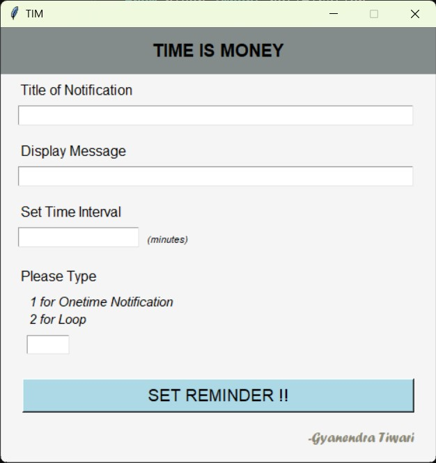
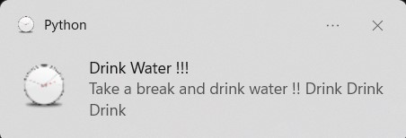

# TIM (TIME IS MONEY)

## _A reminder application you need._

### About

    Tim is simple reminder application built in python that
    will remind you after time time interval you set.

    This application also has interactive GUI made with the
    help of tkinter.

### How to Install ?

    You can clone this repo.. and run this application on your
    computer

### HOW TO USE ?

    After you run the application
    1. Give Title to the notification (eg. Drink Water !)
    2. Write the message (eg. you must drink 3 ltr of water per day)
    3. Set time interval in minutes
        (eg. if you set it as 20 you will get notified after 20 mins )
    4. Select if you want to get notified once or again and again
    5. Press Set Reminder button and you are done.

### How to stop notifications ?

    Just close the terminal in which application is running.

### Sample Image

